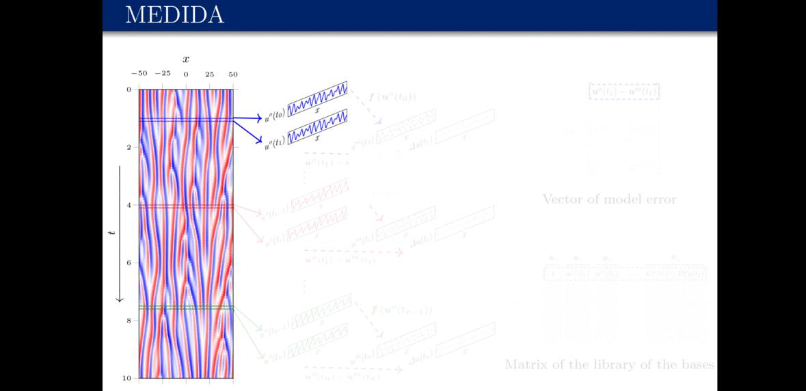

# MEDIDA: Model Error Discovery with Interpretability and Data Assimilation

#### [[Developer's website]](http://www.rmojgani.com)


## Table of contents
* [Introduction](#Introduction)
* [Requirements](#Requirements)
* [Experiments](#Experiments)
    * [Case 1](#Case-1)
* [Citation](#Citation)
* [References](#References)

## Introduction
<!-- An abstract length introduction 
	to the project -->
Models used for many important engineering and natural systems are imperfect. The discrepancy between the mathematical representations of a true physical system and its imperfect model is called the model error. These model errors can lead to substantial difference between the numerical solutions of the model and the observations of the system, particularly in those involving nonlinear, multi-scale phenomena. Thus, there is substantial interest in reducing model errors, particularly through understanding their physics and sources and leveraging the rapid growth of observational data. Here we introduce a framework named MEDIDA: Model Error Discovery with Interpretability and Data Assimilation. MEDIDA only requires a working numerical solver of the model and a small number of noise-free or noisy sporadic observations of the system. In MEDIDA, first the model error is estimated from differences between the observed states and model-predicted states (the latter are obtained from a number of one-time-step numerical integrations from the previous observed states). If observations are noisy, a data assimilation (DA) technique such as ensemble Kalman filter (EnKF) is first used to provide a noise-free analysis state of the system, which is then used in estimating the model error. Finally, an equation-discovery technique, such as the relevance vector machine (RVM), a sparsity-promoting Bayesian method, is used to identify an interpretable, parsimonious, closed-form representation of the model error. Using the chaotic Kuramoto-Sivashinsky (KS) system as the test case, we demonstrate the excellent performance of MEDIDA in discovering different types of structural/parametric model errors, representing different types of missing physics, using noise-free and noisy observations.

## Requirements

- python 3.6
	- [scipy](https://pypi.org/project/scipy/)
	- [numpy](https://pypi.org/project/numpy/)
- RVM from [i]*:
	- [rvm-find](https://github.com/TomBolton/rvm-find)
- Library of the bases from [ii]*:
	- [PDE-FIND](https://github.com/snagcliffs/PDE-FIND)
	
'*' Included in the utils

## Experiments
### System (perfect model): KS
KS [Case KS Location](./experiments/KS) 

Run main.py with all the input arguments
```
python3 -u main.py $CASE_NO $NOISE_MAG $N_ENS $N_SPORADIC $EQN $IF_SIMULATION $IF_RVM
```
where, 

- CASE_NO (type: integer) is the case number [to do: change case numbers as they appear in the paper)

- NOISE_MAG (type: real/float) is the standard deviation of the noise ratio (std of noise to std of singal at each time step)

- N_ENS (type: integer) is the size of ensembles (number of the ensemble members) 

- N_SPORADIC (type: integer) is the number of time-steps between each sample pair

- EQN (type: string) type of the (imperect) model equation: "KS" for KS, "KSpu3x" for KS+c_4 'u_{xxx}'$ KSpu3x_Du3 for KS + c_4 $'u^2u_{x}'$

- IF_SIMULATION (type: boolean) is set to TRUE for generating the ensembles and running the imperect model (otherwise FALSE)

- IF_RVM (type: boolean) is set to TRUE to run RVM to discover the missing physics (otherwise FALSE; set to TRUE if IF_SIMULATION==TRUE or the corresponding saved files exists )


Example: Only run RVM on (already generated data files) case number 1 with 1% noise with $N=10M=10240$ sampling once (one pair) every 10,000 time steps, where the imperfect model is of KS type
```
python3 -u main.py 1 0.01 10240 10000 KS False True
```

Note: [Download](https://rice.box.com/s/3a29sejqyc8ou96ncfrddzo7spncwet4), extract, and include "KS.pkl" in [./experiments/KS/save](./experiments/KS/save)  

## Citation

- \[1\] [Mojgani, R.](https://www.rmojgani.com), [Chattopadhyay, A.](https://scholar.google.com/citations?user=wtHkCRIAAAAJ&hl=en), and [Hassanzadeh, P.
](https://scholar.google.com/citations?user=o3_eO6EAAAAJ&hl=en),
[**Closed-form discovery of structural errors in models of chaotic systems by integrating Bayesian sparse regression and data assimilation.**](https://doi.org/10.1063/5.0091282), Chaos 32, 061105 (2022) 
arXiv:2110.00546.
([Download](https://aip.scitation.org/doi/pdf/10.1063/5.0091282))<details><summary>BibTeX</summary><pre>
@article{Mojgani_Chaos_2022,
author = {Mojgani,Rambod  and Chattopadhyay,Ashesh  and Hassanzadeh,Pedram },
title = {Discovery of interpretable structural model errors by combining Bayesian sparse regression and data assimilation: {A} chaotic Kuramoto–Sivashinsky test case},
journal = {Chaos: {A}n Interdisciplinary Journal of Nonlinear Science},
volume = {32},
number = {6},
pages = {061105},
year = {2022},
doi = {10.1063/5.0091282},
URL = {https://doi.org/10.1063/5.0091282},
eprint = {arXiv:2110.00546}
}</pre></details>

## References
Following open-source libraries/codes are used

- \[i\] [rvm-find](https://github.com/TomBolton/rvm-find)
	- Laure Zanna, and Thomas Bolton. "Data-Driven Equation Discovery of Ocean Mesoscale Closures
", Geophysical Research Letters 47, 17 (2020).([url]( https://doi.org/10.1029/2020GL088376))<details><summary>BibTeX</summary><pre>
@article{Zanna_GRL_2020,
	author = {Zanna, Laure and Bolton, Thomas},
	doi = {10.1029/2020GL088376},
	issn = {19448007},
	journal = {Geophysical Research Letters},
	number = 17,
	pages = 1--13,
	title = {Data-Driven Equation Discovery of Ocean Mesoscale Closures},
	volume = 47,
	year = 2020,
}</pre></details>

- \[ii\] [PDE-FIND](https://github.com/snagcliffs/PDE-FIND)
	- Samuel H Rudy, Steven L Brunton, Joshua L Proctor, and Nathan J Kutz. "Data-driven discovery of partial differential equations", Science Advances 3, 4 (2017).([url]( https://doi.org/10.1126/sciadv.1602614))<details><summary>BibTeX</summary><pre>
@article{Rudy_SA_2017,
	author = {Rudy, Samuel H and Brunton, Steven L and Proctor, Joshua L and Kutz, J Nathan},
	journal = {Science Advances},
	number = 4,
	publisher = {American Association for the Advancement of Science},
	title = {Data-driven discovery of partial differential equations},
	url = { https://advances.sciencemag.org/content/3/4/e1602614 },
	doi = { 10.1126/sciadv.1602614 },
	volume = 3,
	year = 2017,
}</pre></details>


